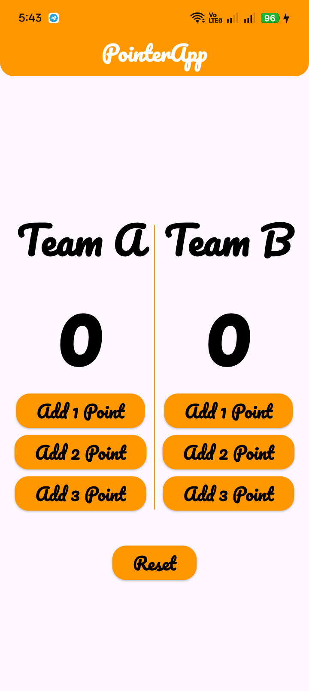

# 🏆 Pointer App

<p align="center">
  A simple and elegant two-team score counter mobile application built with Flutter.
</p>

<p align="center">
  
  
  
</p>

---

## 📱 About The Project

**Pointer App** is a simple two-team score counter application built with **Flutter**.

The application allows users to manage the scores of **Team A** and **Team B**, with the ability to add **1, 2, or 3 points** to each team and reset both scores with a single button.

This project was created as a practical exercise to strengthen my understanding of **Flutter fundamentals**, especially `StatefulWidget`, `setState()`, reusable widgets, callbacks, and clean project organization.

---

## 🎯 Project Objectives

The main objectives of this project were to practice:

* Using `StatefulWidget` and `setState()`
* Managing and updating dynamic application state
* Building reusable custom widgets
* Passing callback functions between widgets
* Using `Row` and `Column` for UI layouts
* Using `Expanded` for flexible layout distribution
* Creating a custom styled `AppBar`
* Using `VerticalDivider` to separate team sections
* Applying custom fonts in Flutter
* Organizing Flutter code into reusable components
* Separating UI components from the main screen logic

---

## ✨ Features

* 🅰️ **Team A Score Counter**
* 🅱️ **Team B Score Counter**
* ➕ Add **1, 2, or 3 points** to each team
* 🔄 Reset both scores to zero
* 🎨 Custom styled AppBar
* 🔲 Rounded AppBar bottom corners
* 🖋️ Custom **Pacifico** font
* 📱 Simple and responsive UI
* 🧩 Reusable custom widgets
* ⚡ Real-time UI updates using `setState()`

---

## 🛠️ Technologies Used

### Languages & Framework

* **Dart**
* **Flutter**
* **Material Design**

### Flutter Widgets

* `MaterialApp`
* `Scaffold`
* `AppBar`
* `StatefulWidget`
* `StatelessWidget`
* `Column`
* `Row`
* `Expanded`
* `VerticalDivider`
* `Padding`
* `SizedBox`
* `ElevatedButton`
* `Text`

### Concepts

* `setState()` for state management
* Callback functions
* Reusable custom widgets
* Widget composition
* `RoundedRectangleBorder`
* `BorderRadiusDirectional`
* Custom fonts
* Basic UI layout and responsiveness

---

## 🧩 Reusable Components

The project uses custom reusable widgets to keep the UI organized and reduce code duplication.

### `StyleFont`

A reusable text widget responsible for applying:

* Font family
* Font size
* Font weight
* Text color

### `StyleButton`

A reusable button component that accepts:

* Button text
* `onTap` callback

This allows the same button design to be reused throughout the application.

### `ItemStyle`

A reusable team component that contains:

* Team name
* Team score
* Add 1 Point button
* Add 2 Point button
* Add 3 Point button

This keeps the Team A and Team B UI consistent and avoids repeating the same layout code.

---

## 🏗️ Project Structure

```text
pointer_app/
│
├── lib/
│   ├── main.dart
│   │
│   ├── modules/
│   │   └── home_view.dart
│   │
│   └── shared/
│       └── component/
│           └── component/
│               ├── button_style.dart
│               ├── font_style.dart
│               └── item_style.dart
│
├── assets/
│   ├── images/
│   │   └── img.png
│   │
│   └── fonts/
│       └── Pacifico-Regular.ttf
│
├── pubspec.yaml
└── README.md
```

---

## 📱 App Preview

<p align="center">
  
</p>

---

## 🧠 What I Learned

Building this project helped me strengthen my understanding of Flutter's basic concepts and application structure.

Through this project, I practiced:

* Managing application state using `StatefulWidget`
* Updating the UI using `setState()`
* Creating reusable and decoupled widgets
* Passing data through widget constructors
* Passing callback functions between widgets
* Building layouts using `Row`, `Column`, and `Expanded`
* Creating reusable buttons and text components
* Separating team UI into a reusable `ItemStyle` widget
* Using a single `addPoints()` method to handle both teams
* Styling an `AppBar` using `RoundedRectangleBorder`
* Applying a custom font throughout the application
* Organizing Flutter files into separate components

---

## ⚙️ How It Works

The application maintains two integer variables:

```dart
int pointTeamA = 0;
int pointTeamB = 0;
```

When the user presses one of the score buttons, the `addPoints()` method updates the corresponding team:

```dart
void addPoints(String team, int points) {
  setState(() {
    if (team == 'A') {
      pointTeamA += points;
    } else if (team == 'B') {
      pointTeamB += points;
    }
  });
}
```

Using `setState()` automatically rebuilds the affected UI and displays the updated score.

The **Reset** button sets both scores back to zero.

---

## 🚀 Getting Started

### Prerequisites

Before running this project, make sure you have:

* Flutter SDK
* Dart SDK
* Android Studio or Visual Studio Code
* Flutter & Dart extensions

You can verify your Flutter installation using:

```bash
flutter doctor
```

---

### 📥 Installation

#### 1. Clone the repository

```bash
git clone https://github.com/youssefmohamedflutter/pointer_app.git
```

#### 2. Navigate to the project directory

```bash
cd pointer_app
```

#### 3. Install dependencies

```bash
flutter pub get
```

#### 4. Make sure the custom font is registered in `pubspec.yaml`

```yaml
flutter:
  fonts:
    - family: Pacifico
      fonts:
        - asset: assets/fonts/Pacifico-Regular.ttf
```

#### 5. Run the application

```bash
flutter run
```

---

## 📦 Assets

The project uses a custom **Pacifico** font:

```text
assets/fonts/Pacifico-Regular.ttf
```

The application screenshot is located at:

```text
assets/images/img.png
```

Make sure the assets are correctly registered in `pubspec.yaml` if required.

---

## 🔗 Links

### 💻 GitHub

[github.com/youssefmohamedflutter](https://github.com/youssefmohamedflutter)

### 💼 LinkedIn

[linkedin.com/in/youssef-mohamed-7a2891423](https://www.linkedin.com/in/youssef-mohamed-7a2891423/)

---

## 👨‍💻 Author

**Youssef Gado**

Flutter Developer

I am passionate about building mobile applications with Flutter and continuously improving my skills in software development, clean code, and application architecture.

---

## ⭐ Support

If you found this project useful or liked the idea, don't forget to give the repository a ⭐ **Star**.

Your support is always appreciated!

---

## 📄 License

This project is licensed under the **MIT License**.
